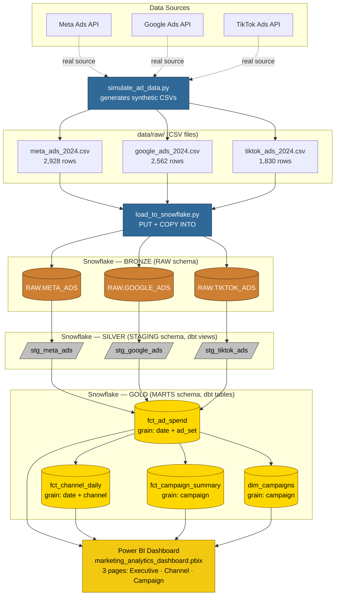
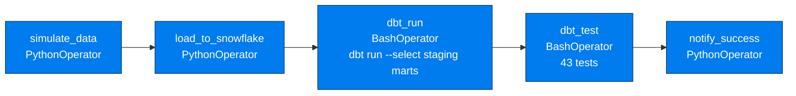
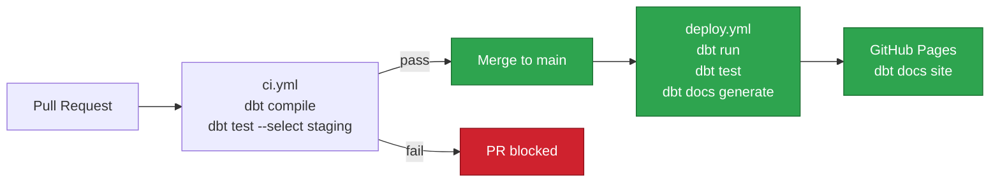

# Data Flow

End-to-end data lineage for the marketing analytics pipeline. Sources flow through Bronze (raw), Silver (staging), and Gold (marts) layers in Snowflake before landing in Power BI.

## Pipeline Overview

## Layer Responsibilities

| Layer | Tool | What happens | Materialization |
|---|---|---|---|
| Source | Python | `simulate_ad_data.py` writes 3 CSVs to `data/raw/` | CSV files |
| Ingestion | Python + snowflake-connector | `load_to_snowflake.py` runs `PUT` then `COPY INTO`, sets `_loaded_at` audit column | — |
| Bronze | Snowflake | Raw rows mirrored as-is from CSV, no transforms | Tables |
| Silver | dbt | Type casts, filters `impressions = 0`, derives `click_through_rate`, `cost_per_conversion`, `roas`, generates `surrogate_key` from `date + ad_set_id` | Views |
| Gold | dbt | `fct_ad_spend` unions all three staging models; `fct_channel_daily`, `fct_campaign_summary`, `dim_campaigns` aggregate from `fct_ad_spend` | Tables |
| BI | Power BI | Reads Gold tables via Snowflake connector | .pbix file |

## Orchestration Flow (Airflow DAG)

The [marketing_pipeline_dag.py](airflow/dags/marketing_pipeline_dag.py) DAG runs daily at 06:00 UTC.

## CI/CD Flow (GitHub Actions)

## Data Quality Gates

- **Source-level** — `not_null` tests on RAW columns via `sources.yml`
- **Staging** — `unique` + `not_null` on `surrogate_key`; `not_null` on `date`, `channel`, `campaign_id`, `ad_set_id`
- **Marts** — `dbt_expectations.expect_column_values_to_be_between` on `spend` (0–10,000) and `roas` (0–50) in `fct_ad_spend`
- **CI** — staging tests must pass before any PR can merge to `main`
