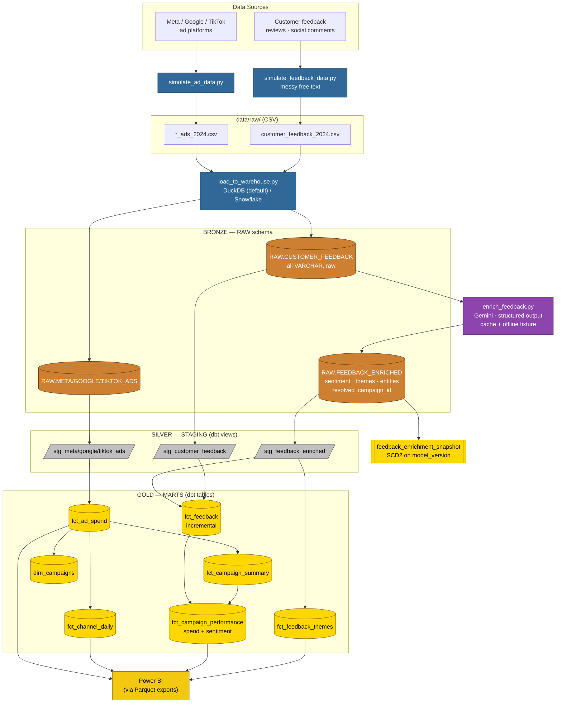
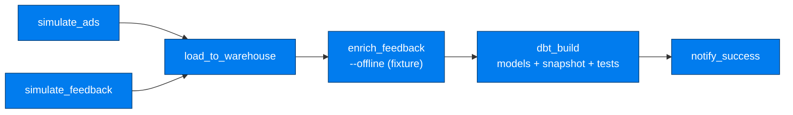
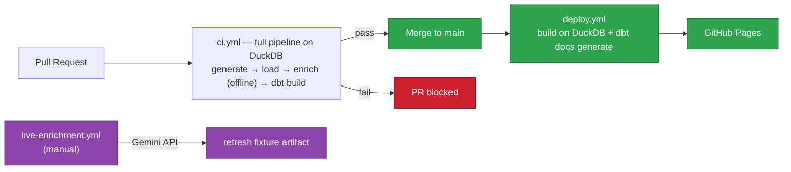

# Data Flow

End-to-end lineage. Two sources — structured ad data and unstructured customer
feedback — flow through Bronze → Silver → Gold. Feedback is LLM-enriched between
Bronze and Silver. The warehouse is DuckDB locally and in CI, Snowflake in prod.

## Pipeline Overview

## Layer Responsibilities

| Layer | Tool | What happens | Materialization |
|---|---|---|---|
| Source | Python | Simulate ad CSVs + messy feedback CSV | CSV files |
| Ingestion | Python | `load_to_warehouse.py` loads Bronze (DuckDB or Snowflake) | Tables |
| Enrichment | Python + Gemini | `enrich_feedback.py` produces structured fields; cached to a fixture | RAW.FEEDBACK_ENRICHED |
| Bronze | warehouse | Raw rows as-loaded; feedback all-VARCHAR | Tables |
| Silver | dbt | Cast/derive ad metrics; normalize feedback channel/date/rating; type enrichment | Views |
| Gold | dbt | Ad marts; `fct_feedback` (incremental); themes bridge; `fct_campaign_performance` joins spend to sentiment | Tables |
| Snapshot | dbt | SCD2 history of enrichment, keyed on `model_version` | Table |
| BI | Power BI | Reads Gold via Parquet exports | .pbix |

## Orchestration (Airflow DAG)

## CI/CD (GitHub Actions)

## Data Quality Gates

- **Source-level** — `not_null` on RAW columns; `unique` feedback_id
- **Staging** — surrogate-key `unique`/`not_null`; `accepted_values` on normalized channel
- **Enrichment (LLM output)** — `accepted_values` (sentiment, themes), confidence in
  [0,1], `relationships` resolved_campaign_id → dim_campaigns, and a singular test
  failing the build if resolution precision < 80% vs. ground truth
- **CI** — the full pipeline + all tests must pass on DuckDB before any PR merges
