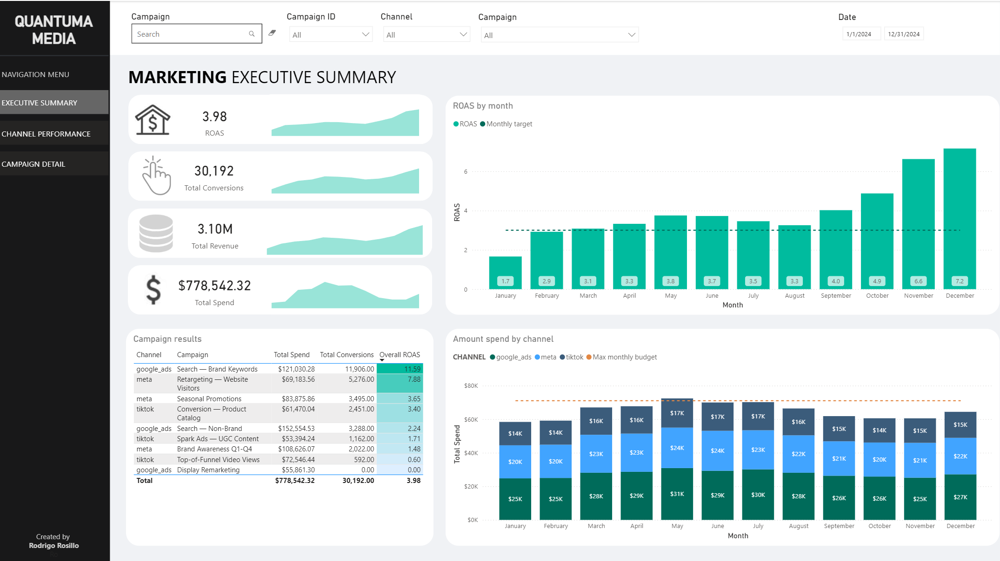
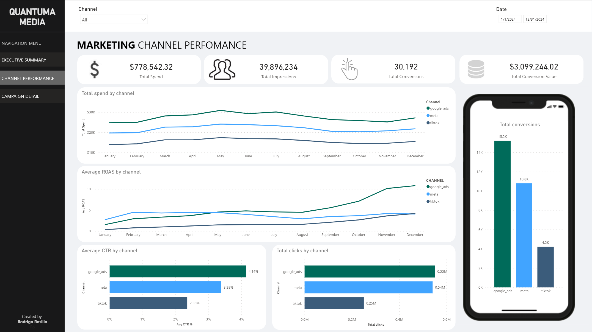
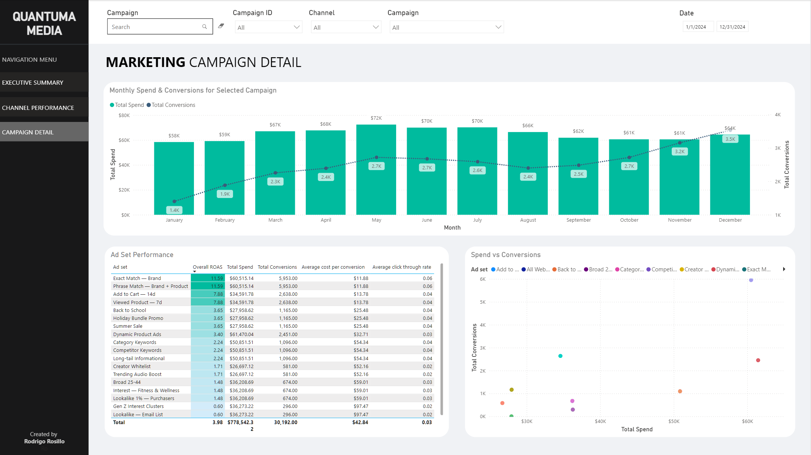

# Marketing Analytics Pipeline

Multi-channel ad performance pipeline — Meta, Google Ads, TikTok data loaded into Snowflake, modeled with dbt, orchestrated with Airflow, tested end-to-end with 43 automated data quality checks.

---

## Dashboard

Three-page Power BI report built on the Gold layer. Slicers for date range, channel, and campaign filter all pages.

### Executive Summary


### Channel Performance


### Campaign Detail


[Download .pbix](dashboard/marketing_analytics_dashboard.pbix)

---

## Architecture

```
┌─────────────────────────────────────────────────────────────────────┐
│                         Data Sources                                │
│         Meta Ads · Google Ads · TikTok Ads (CSV / API)              │
└───────────────────────────┬─────────────────────────────────────────┘
                            │  Python  (ingestion/load_to_snowflake.py)
                            │  PUT + COPY INTO
                            ▼
┌─────────────────────────────────────────────────────────────────────┐
│                     Snowflake — BRONZE (RAW)                        │
│           RAW.META_ADS · RAW.GOOGLE_ADS · RAW.TIKTOK_ADS           │
│                  Raw rows, no transforms, _loaded_at audit          │
└───────────────────────────┬─────────────────────────────────────────┘
                            │  dbt staging models
                            ▼
┌─────────────────────────────────────────────────────────────────────┐
│                     Snowflake — SILVER (STAGING)                    │
│       stg_meta_ads · stg_google_ads · stg_tiktok_ads (views)       │
│         Typed columns, derived CTR / CPA / ROAS, nulls filtered     │
└───────────────────────────┬─────────────────────────────────────────┘
                            │  dbt mart models
                            ▼
┌─────────────────────────────────────────────────────────────────────┐
│                      Snowflake — GOLD (MARTS)                       │
│   fct_ad_spend · fct_channel_daily · fct_campaign_summary          │
│   dim_campaigns (tables)                                            │
└───────────────────────────┬─────────────────────────────────────────┘
                            │
                            ▼
                     Power BI Dashboard
```

**Orchestration:** Airflow DAG runs daily at 06:00 UTC — simulate → load → dbt run → dbt test → notify.

**CI/CD:** GitHub Actions runs `dbt compile` + `dbt test --select staging` on every PR. Merges to `main` trigger a full `dbt run`, `dbt test`, and docs deploy to GitHub Pages.

---

## Tech Stack

| Layer | Tool | Purpose |
|---|---|---|
| Ingestion | Python + snowflake-connector-python | Bulk-load CSVs via PUT + COPY INTO |
| Warehouse | Snowflake (X-Small) | Cloud-native storage and compute |
| Transformation | dbt Core + dbt_utils + dbt_expectations | Typed models, surrogate keys, data quality tests |
| Orchestration | Apache Airflow | Daily DAG with retries and dependency management |
| CI/CD | GitHub Actions | PR validation and docs deployment to GitHub Pages |
| BI | Power BI | Three-page report on Gold layer |

---

## Data Model

### Bronze — `RAW` schema

Raw tables loaded as-is from source CSVs. No transformations. All three tables share the same schema:

| Column | Type | Description |
|---|---|---|
| date | VARCHAR | Ad performance date |
| channel | VARCHAR | Source channel (meta / google_ads / tiktok) |
| campaign_id | VARCHAR | Platform campaign identifier |
| campaign_name | VARCHAR | Human-readable campaign name |
| objective | VARCHAR | awareness / traffic / conversion |
| ad_set_id | VARCHAR | Ad set / ad group identifier |
| ad_set_name | VARCHAR | Human-readable ad set name |
| impressions | NUMBER | Total impressions served |
| clicks | NUMBER | Total clicks |
| spend | FLOAT | Total spend in USD |
| conversions | NUMBER | Total conversions |
| conversion_value | FLOAT | Revenue attributed to conversions |
| cpc | FLOAT | Cost per click |
| currency | VARCHAR | Always USD |
| _loaded_at | TIMESTAMP | Audit column — set by Snowflake on load |

### Silver — `STAGING` schema

Three views (`stg_meta_ads`, `stg_google_ads`, `stg_tiktok_ads`) that clean, cast, and enrich the raw tables. Added columns:

- `surrogate_key` — SHA-256 hash of `date + ad_set_id` via `dbt_utils.generate_surrogate_key`
- `click_through_rate` — `ROUND(clicks / NULLIF(impressions, 0), 6)`
- `cost_per_conversion` — `ROUND(spend / NULLIF(conversions, 0), 4)`
- `roas` — `ROUND(conversion_value / NULLIF(spend, 0), 4)`

Rows with `impressions = 0` are filtered at this layer.

### Gold — `MARTS` schema

| Model | Grain | Rows | Description |
|---|---|---|---|
| `fct_ad_spend` | date + ad_set | 7,320 | Union of all three staging models — one row per ad set per day |
| `fct_channel_daily` | date + channel | 1,098 | Daily aggregates by channel with total spend, ROAS, CTR, CPA |
| `fct_campaign_summary` | campaign | 9 | Lifetime campaign metrics plus total days active |
| `dim_campaigns` | campaign | 9 | Campaign dimension — channel, objective, names |

---

## Data Quality

43 dbt tests run on every deployment:

- `unique` and `not_null` on all surrogate keys and foreign keys across staging and mart models
- `not_null` on date, channel, campaign_id, ad_set_id
- `dbt_expectations.expect_column_values_to_be_between` on `spend` (0–10,000) and `roas` (0–50) in `fct_ad_spend`
- Source-level `not_null` tests on `RAW` tables via `sources.yml`

The CI workflow blocks merges if any test fails.

---

## Design Decisions

**Snowflake over SQL Server.** I used SQL Server professionally for three years. It works well for operational workloads but requires managing server infrastructure and storage yourself. Snowflake separates storage from compute — the warehouse suspends when idle, so a pipeline that runs once daily costs almost nothing outside that daily window. That matters when you want a portfolio project running for months without a surprise bill. The native integration with dbt and Power BI also avoids the ODBC driver management that SQL Server connections on cloud BI tools usually require.

**dbt for transformations.** The alternative is raw SQL in stored procedures or Python jobs. Those work, but there is no built-in way to test them, no column-level documentation, and no lineage graph. With dbt, every model has a `schema.yml` file that documents each column and defines tests — the docs site generated from this project is published to GitHub Pages on every merge. The tests also made it safe to refactor the staging models when the schema changed: any breakage shows up immediately.

**Medallion architecture.** The Bronze/Silver/Gold split is not decorative. Bronze tables are never modified after load — if a Silver model has a bug, I can fix it without touching raw data. Silver is only for casting and derived metrics that are mathematically unambiguous (CTR is always clicks/impressions). Business definitions — what counts as a "conversion" for a campaign summary vs. a daily rollup — live in the Gold mart models where they are visible and testable. Without this separation, business logic tends to accumulate in dashboards where nobody can see or test it.

**GitHub Actions for CI/CD.** Every pull request runs `dbt compile` to catch SQL syntax errors before they hit Snowflake, then runs `dbt test --select staging` against the actual data. If a test fails, the PR cannot merge. This catches problems at the review stage rather than generating a Slack alert after something already broke in production.

---

## How to Run Locally

### Prerequisites

- Python 3.11+
- A Snowflake account (free 30-day trial at trial.snowflake.com)
- Git

### Setup

```bash
# 1. Clone the repo
git clone https://github.com/Rodrigo-Rosillo/marketing-analytics-pipeline.git
cd marketing-analytics-pipeline

# 2. Install Python dependencies
pip install snowflake-connector-python python-dotenv dbt-snowflake

# 3. Configure credentials
cp .env.example .env
# Edit .env with your Snowflake account details

# 4. Run Snowflake setup (once)
# Paste snowflake/setup.sql into a Snowsight worksheet and run as ACCOUNTADMIN
# Change the MARKETING_PIPELINE_USER password before running

# 5. Generate synthetic data
python ingestion/simulate_ad_data.py
# Output: data/raw/meta_ads_2024.csv, google_ads_2024.csv, tiktok_ads_2024.csv

# 6. Load to Snowflake
python ingestion/load_to_snowflake.py --truncate
# Expected: ~7,320 rows across 3 tables

# 7. Run dbt
cd dbt
dbt deps                          # install dbt_utils and dbt_expectations
dbt run --select staging          # build Silver views
dbt run --select marts            # build Gold tables
dbt test                          # run all 43 tests
dbt docs generate && dbt docs serve  # browse docs at localhost:8080
```

### Environment Variables

```
SNOWFLAKE_ACCOUNT=<account-identifier>
SNOWFLAKE_USER=MARKETING_PIPELINE_USER
SNOWFLAKE_PASSWORD=<your-password>
SNOWFLAKE_DATABASE=MARKETING_ANALYTICS
SNOWFLAKE_SCHEMA=RAW
SNOWFLAKE_WAREHOUSE=MARKETING_WH
```

---

## Project Structure

```
marketing-analytics-pipeline/
├── .env.example
├── .github/
│   └── workflows/
│       ├── ci.yml                        # PR: dbt compile + dbt test --select staging
│       ├── deploy.yml                    # main push: dbt run + test + docs to Pages
│       └── README.md
├── airflow/
│   ├── README.md
│   └── dags/
│       └── marketing_pipeline_dag.py     # Daily DAG: simulate → load → dbt → notify
├── dashboard/
│   ├── marketing_analytics_dashboard.pbix
│   └── screenshots/
│       ├── page1_executive_summary.png
│       ├── page2_channel_performance.png
│       └── page3_campaign_detail.png
├── data/
│   └── raw/
│       ├── meta_ads_2024.csv             # 2,928 rows
│       ├── google_ads_2024.csv           # 2,562 rows
│       └── tiktok_ads_2024.csv           # 1,830 rows
├── dbt/
│   ├── dbt_project.yml
│   ├── packages.yml                      # dbt_utils + dbt_expectations
│   ├── profiles.yml
│   ├── macros/
│   │   └── generate_schema_name.sql
│   └── models/
│       ├── staging/
│       │   ├── sources.yml
│       │   ├── schema.yml
│       │   ├── stg_meta_ads.sql
│       │   ├── stg_google_ads.sql
│       │   └── stg_tiktok_ads.sql
│       └── marts/
│           ├── schema.yml
│           ├── fct_ad_spend.sql
│           ├── fct_channel_daily.sql
│           ├── fct_campaign_summary.sql
│           └── dim_campaigns.sql
├── ingestion/
│   ├── simulate_ad_data.py
│   └── load_to_snowflake.py
└── snowflake/
    └── setup.sql
```

---

## GitHub Actions Secrets Required

Set these under **Settings → Secrets and variables → Actions**:

| Secret | Value |
|---|---|
| `SNOWFLAKE_ACCOUNT` | Your account identifier (e.g. `yudbpja-bp81892`) |
| `SNOWFLAKE_USER` | `MARKETING_PIPELINE_USER` |
| `SNOWFLAKE_PASSWORD` | Password set in `snowflake/setup.sql` |

GitHub Pages must be enabled under **Settings → Pages → Source → GitHub Actions**.
